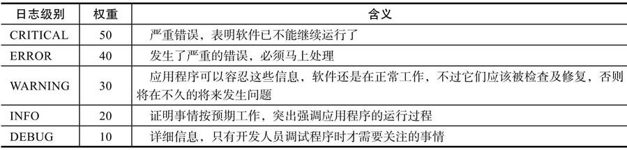

### logging

 - CRITICAL
 - ERROR
 - WARNING
 - INFO
 - DEBUG



###### 配置

```python
import logging

logging.basicConfig(
    level=logging.WARNING,
    format='%(asctime)s%: %(levelname): %(message)s'
    filename='/path/to/log/file.log',
    )
```

 - Logger  日志记录器
 - Handler 日志处理器（保存位置，保存多久deng）
 - Formater 格式化输出
